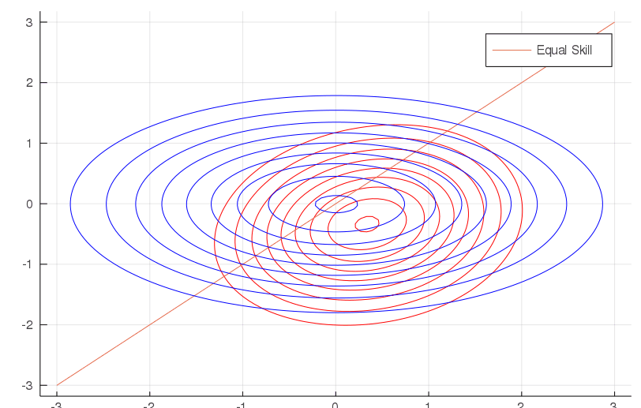
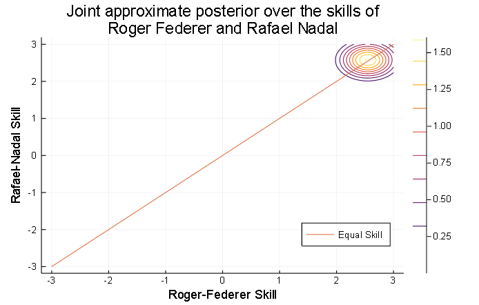

This project demonstrates Stochastic Variational Inference in the TrueSkill Model, using Bayesian inference in large models with continuous latent variables and Markov Chain Monte Carlo on tennis data sets.

 

## Implementations include:
* `Project.toml` packages for the Julia environment.
* `autograd_starter.py` Python with autograd.
* `tennis_data.mat` dataset containing outcomes of tennis games.
* `src.jl` source code in Julia
* **`Julia-True-Skill-Model-Using-Markov-Chain-Monte-Carlo-Final.ipynb`** the jupyter notebook

Note: this project is part of of the assignment from Statistical Methods for Machine Learning II at the Univeristy of Toronto.
